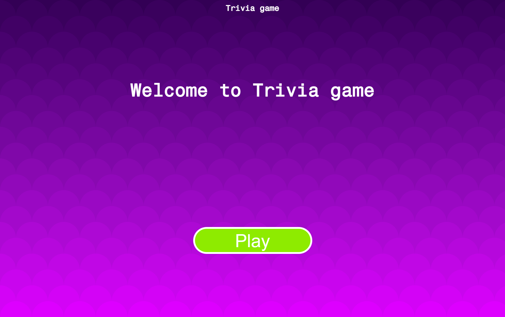
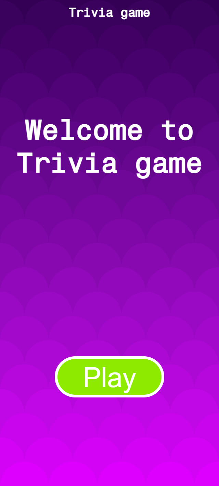
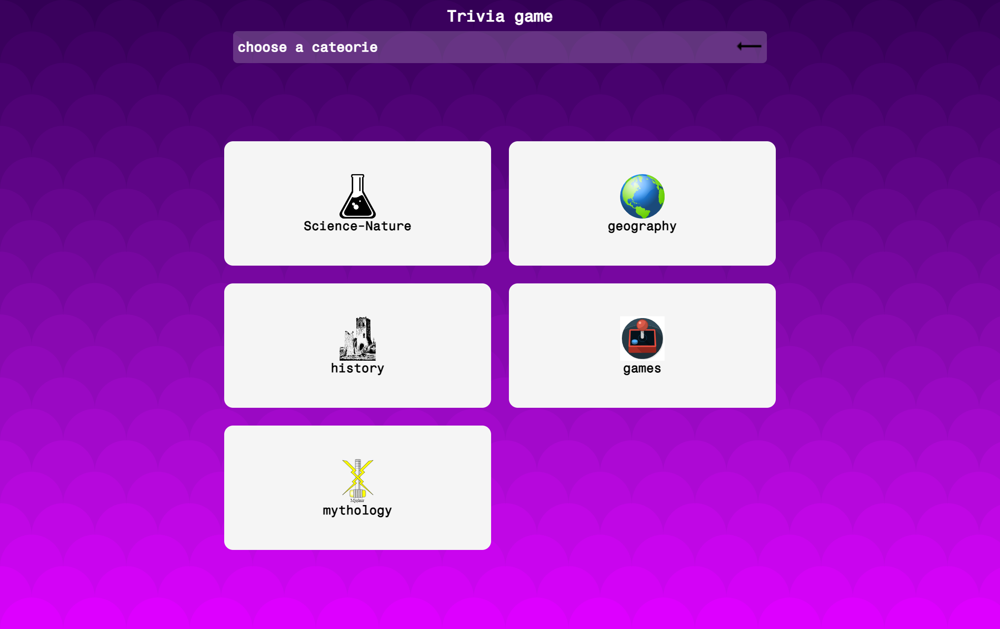
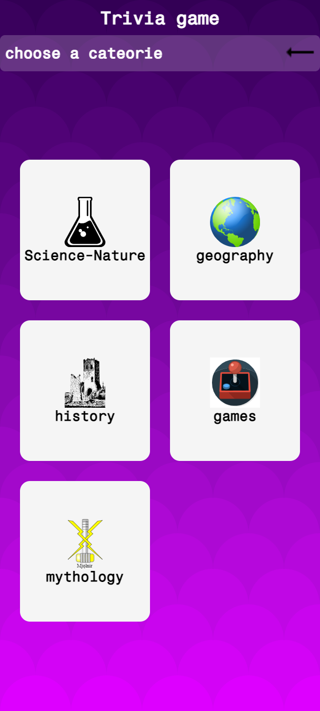
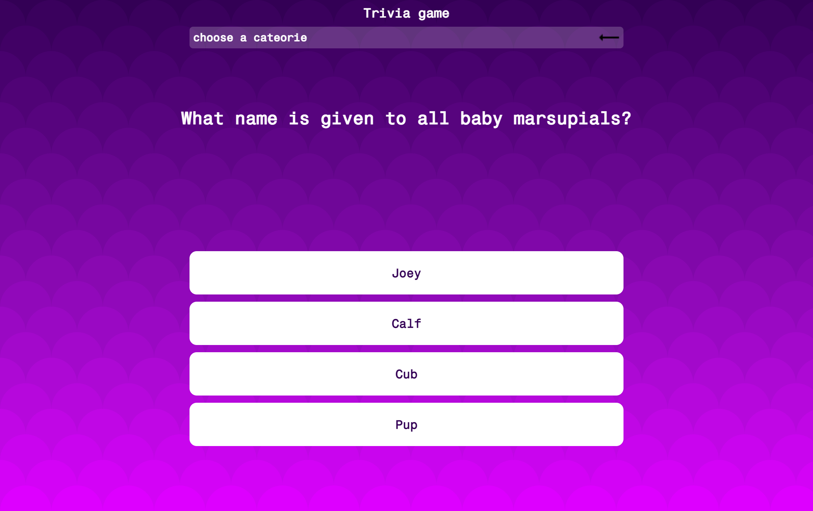
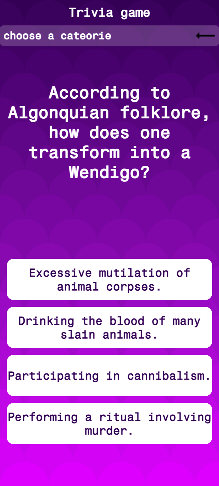
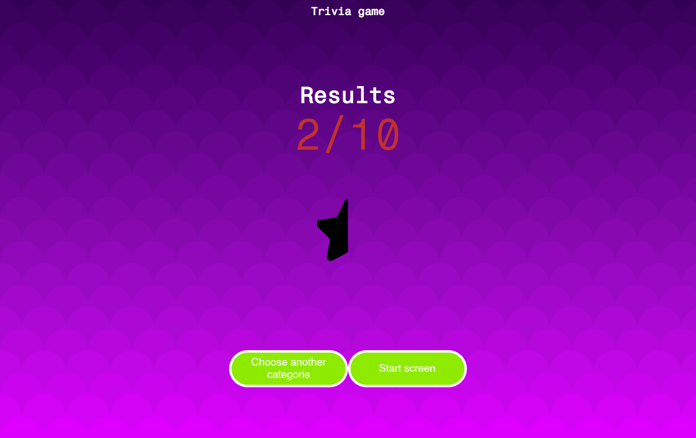
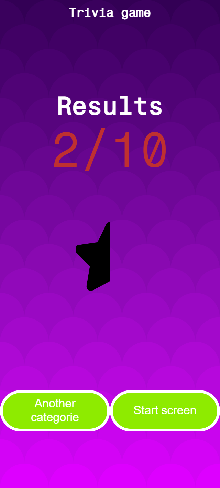

# Trivia-game

Juego de trivia en ingles mobile first utilizando Trivia API de opentdb.com

## Pantallas

### Pantalla inicial

### Pantalla Categorías

### Pantalla Preguntas

### Pantalla resultado

